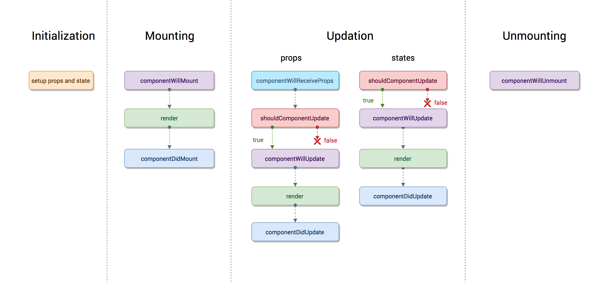

 # 1. What is an event in React?
An event is an action that a user or system may trigger, such as pressing a key, a mouse click, etc.


# 2. What is JSX?

JSX is a syntax extension of JavaScript. It is used with React to describe what the user interface should look like. By using JSX, we can write HTML structures in the same file that contains JavaScript code.

# 3. What is the virtual DOM?

DOM stands for Document Object Model. The DOM represents an HTML document with a logical tree structure. Each branch of the tree ends in a node, and each node contains objects.

# 4. How is React different from Angular?
|| *Angular*| *React*  |
|-------|--------|--------|
|****Author**** |Google  |Facebook|
|****Architecture****|Complete MVC|View layer of MVC|
|****DOM****|Real DOM|Virtual DOM|
|****Data-Binding****|Bi-directional|Uni-directional|
|****Rendering****|Client-Side|Server-Side|
|****Performance****|Comparatively slow|Faster due to Virtual DOM|
|

# 5. What are the components in React?

Components are the building blocks of any React application, and a single app usually consists of multiple components.

* Functional Components: These types of components have no state of their own and only contain render methods, and therefore are also called stateless components.
```js
function Greeting(props) {
  return <h1>Welcome to {props.name}</h1>;
}
```
* Class Components: These types of components can hold and manage their own state and have a separate render method to return JSX on the screen.
```js
class Greeting extends React.Component {
  render() {
    return <h1>Welcome to {this.props.name}</h1>;
  }
}
```

# 6.  What is the use of render() in React?
* It is required for each component to have a render() function. Thfunction returns the HTML, which is to be displayed in the component.
* If you need to render more than one element, all of the elements must be inside one parent tag like 
```js 
<div>, <form>.
```
# 7. What are props in React?

 * Props are short for Properties. It is a React built-in object that stores the value of attributes of a tag and works similarly to HTML attributes.
* Props provide a way to pass data from one component to another component. Props are passed to the component in the same way as arguments are passed in a function.

# 8. What are the differences between state and props?

||*State*| *Props* |
|-------|--------|--------|
|**Use** |Holds information about the components  |Allows to pass data from one component to other components as an argument|
|**Mutability**|Is mutable|Are immutable|
|**Read-only**|Can be changed|Are read-only|
|**Child components**|Child components cannot access |Child component can access |
|**Stateless components**|Cannot have state|Can have props|
|

# 9. What is a higher-order component in React?

A higher-order component acts as a container for other components. This helps to keep components simple and enables re-usability. They are generally used when multiple components have to use a common logic. 

# 10. What are the differences between class and functional components?
||*Class Components*| *Functional Components* |
|-------|--------|--------|
|**State** |Can hold or manage state |Cannot hold or manage state|
|**Simplicity**|Complex as compared to the stateless component|Simple and easy to understand|
|**Lifecycle methods**|Can work with all lifecycle methods|Does not work with any lifecycle method|
|**Reusability**|Can be reused |Cannot be reused |
|

# 11. Explain the lifecycle methods of components.


# 12. What is React Router?
React Router is a routing library built on top of React, which is used to create routes in a React application. This is one of the most frequently asked react interview questions.

# 13. How is React routing different from conventional routing?
||*React Routing*| *Conventional routing* |
|-------|--------|--------|
|**1.**  |Single HTML page|Each view is a new HTML file|
|**2.** |The user navigates multiple views in the same file|The user navigates multiple files for each view|
|**3.** |The page does not refresh since it is a single file|The page refreshes every time user navigates|
|**4.** |Improved performance |Slower performance |
|

# 14. How do you style React components?

There are several ways in which we can style React components:
* Inline Styling
```js
function MyComponent(){  
return <div style={{ color: 'blue', lineHeight : 10, padding: 20 }}> Inline Styled Component</div>  
}
```
* JavaScript Object
```js
var stylingObject = {
  div: {
    color: "red",
    border: "1px solid red"
  }
}
function App() {
  return (
      <div style={stylingObject.div}>
        <input type="text" />
      </div>
  );
}
```
* CSS Stylesheet
```js
//Button.css
.Button {
  padding: 20px;
}
//Button.js
import React, { Component } from 'react';
import './Button.css';

class Button extends Component {
  render() {
    return <div className="Button" />;
  }
}
```
# 15. What are the rules for hooks in React?

Hooks in React have two fundamental rules:

* Hooks can only be used on functional components or custom hooks.
* Hooks can only be called at the top level of a component. They cannot be called inside loops, conditionals, or nested functions.

# 16. What are refs in React?

Refs allow us to create a reference to a DOM element or value that will persist between renders. They can be declared via the createRef command or with the useRef hook.

# 17. What are stateless components?

Stateless components are components that have no state. These components are created with a function and do not have access to the application state.

# 18. What is the StrictMode in React?

The StrictMode is a component that allows us to activate some development checks in React. For example, it detects components that are rendered unnecessarily or deprecated functionality that is being used.
```js
import { StrictMode } from 'react'

function App() {
  return (
    <StrictMode>
      <Component />
    </StrictMode>
  )
}
```
# 19. What are Hooks? 
Hooks are functions that let us “hook into” React state and lifecycle features from a functional component.

### Why were Hooks introduced in React?

React hooks were introduced in the 16.8 version of React.

# 20. What are Custom Hooks?

A Custom Hook is a function in Javascript whose name begins with ‘use’ and which calls other hooks. It is a part of React v16.8 hook update and permits you for reusing the stateful logic without any need for component hierarchy restructuring.

# 21. What are Higher Order Components?
Simply put, Higher-Order Component(HOC) is a function that takes in a component and returns a new component.


# 22. Difference between async await/promise
||*PROMISE*| *ASYNC/WAIT* |
|-------|--------|--------|
|**SCOPE** |Only the chain promise itself is asynchronous|The entire wrapper function is asynchronous|
|**LOGIC**|* synchronous work can be handled in the same callback. * Using multiple promises with Promise.all()|* synchronous job must be taken out of the callback * Multiple promises can be handled with simple variables|
|**ERROR HANDLING**| * Then * Catch * Finally| * Try * Catch * Finally|
|

# 23. What are ForwardRefs?

### React.forwardRef
Create a React component that sends the ref attribute it receives to another component further down the tree. This technique is not very common, but it is particularly useful in two scenarios:

* ***Send refs to DOM components***
* ***Send refs in higher order components*** 

React.forwardRef accepts a render function as an argument. React will call this function with props and ref as two arguments. This function should return a React node.

# 24. difference between ES5 and ES6
|*ES5*| *ES6* |
|--------|--------|
|In the case of ES5 function and return both keywords must be used to define the functions|In the case of ES6, you don't need to use the function keyword to define the function and you can also avoid the return keyword to get the value|
|ES5 offers the same features and functionality, but it takes a bit more time than ES6.|Object manipulation can be processed more smoothly due to the presence of destructuring and fast operators.|
|ES5 is the version before ES6, therefore due to the absence of some features its performance is a little lower than ES6|With the help of newly implemented features and shorthand storage implementation it gets higher performance than ES5|
|ES5 provides a broader range of community supports than ES6|ES6 has a lot of support community, however it is smaller than ES5|
|