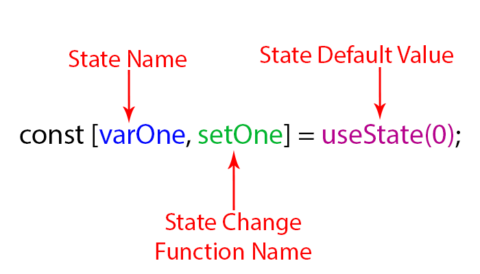

#  useState

We call it inside a function component to add some local state to it. React will preserve this state between re-renders. useState returns a pair: the current state value and a function that lets you update it.

The only argument to useState is the initial state.  The initial state argument is only used during the first render.

The array destructuring syntax lets us give different names to the state variables we declared by calling useState. These names aren’t a parof the useState API. Instead, React assumes that if you call useState many times, you do it in the same order during every render. We’ll come back to why this works and when this is useful later.

### What does calling useState do? 

It declares a “state variable”. Our variable is called,Normally, variables “disappear” when the function exits but state variables are preserved by React.

### What do we pass to useState as an argument? 

The only argument to the useState() Hook is the initial state. 

### What does useState return?

It returns a pair of values: 
the current state and a function that updates it. 