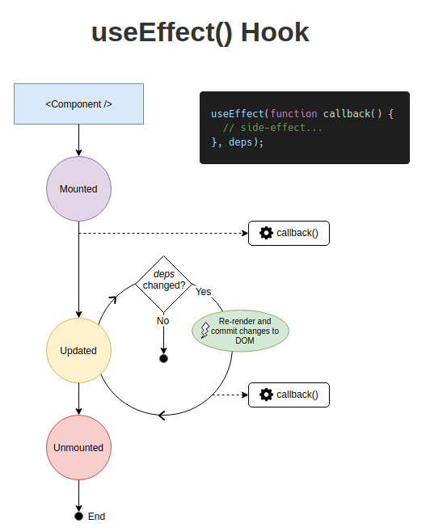

# useEffect
***useEffect*** is a React Hook that lets you synchronize a component with an external system.

The function passed to useEffect will run after the render is committed to the screen.

By default, effects run after every completed render

### Usage

* Wrapping Effects in custom Hooks
* Fetching data with Effects
* Updating state based on previous state from an Effect
* Removing unnecessary object dependencies
* Removing unnecessary function dependencies

 *What does **useEffect** do?*

You tell React that your component needs to do something after render.

* *Why is **useEffect** called inside a component?* 

Placing useEffect inside the component lets us access the  state variable  right from the effect. 

* *Does **useEffect** run after every render?*

 Yes! By default, it runs both after the first render and after every update. 

