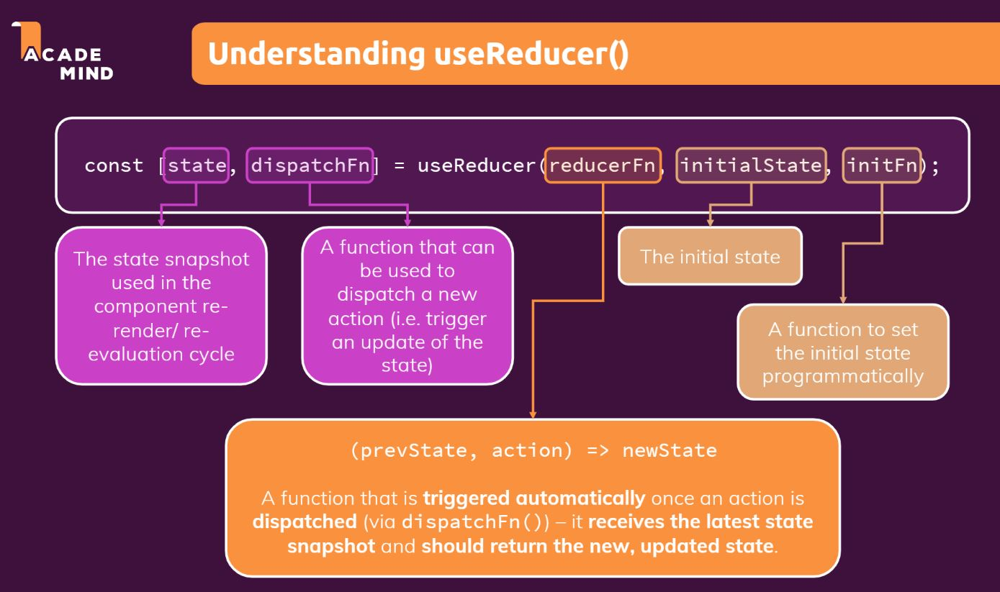

# useReducer 
Is a React Hook that lets you add a reducer to your component.

Accepts a reducer of type ***(state, action) => newState***, and returns the current state paired with a dispatch method.

 useReducer also lets you optimize performance for components that trigger deep updates because you can pass dispatch down instead of callbacks.

 

 ``` javascript
 const [state, dispatch] = useReducer(reducer, initialArg, init);
 ```
### Usage
* Adding a reducer to a component
* Writing the reducer function
* Avoiding recreating the initial state

### Parameters 
* reducer: The reducer function that specifies how the state gets updated.
* initialArg: The value from which the initial state is calculated.
* optional init: The initializer function that specifies how the initial state is calculated.

### Returns 
useReducer returns an array with exactly two values:
1. The current state. 
2. The dispatch function that lets you update the state to a different value and trigger a re-render.

